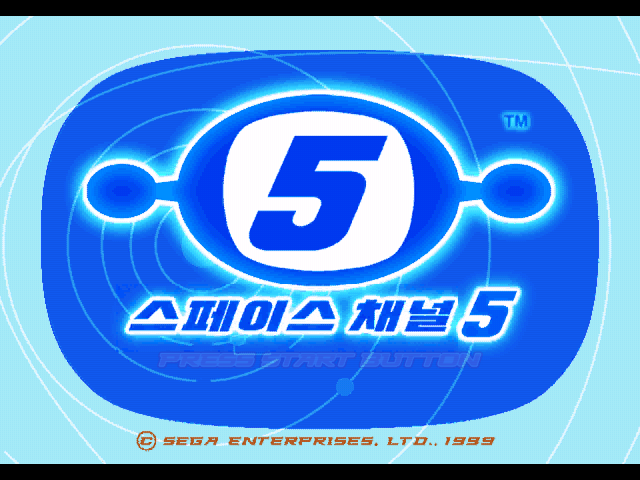
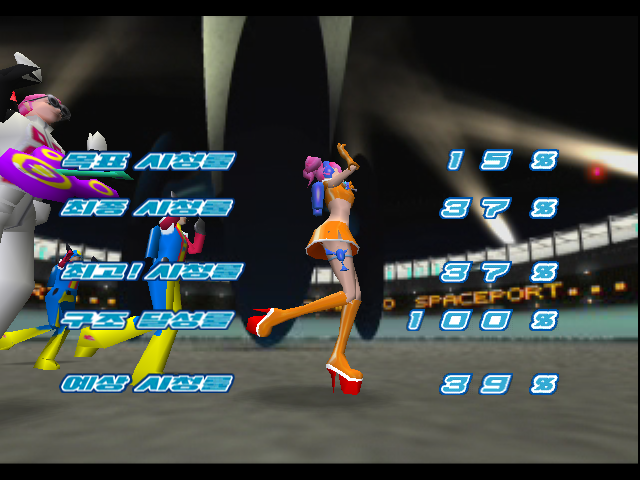
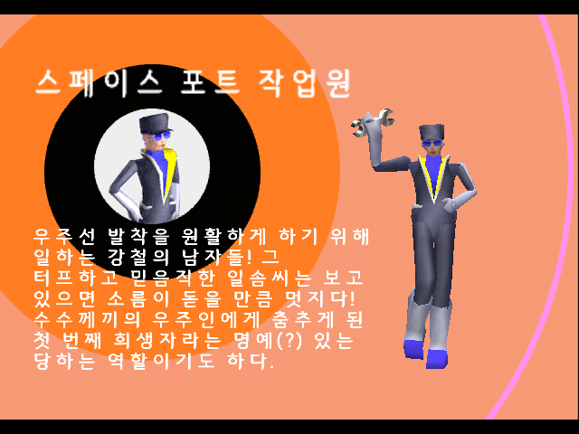
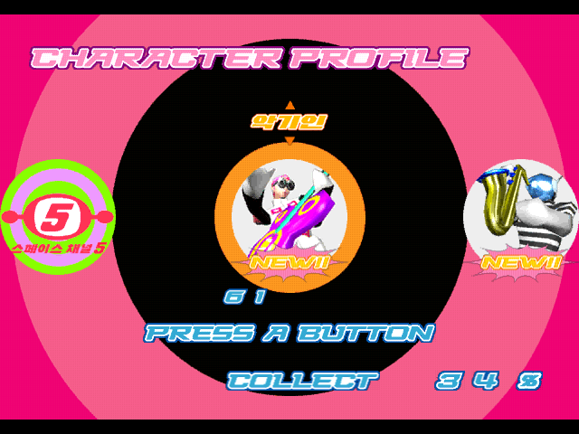
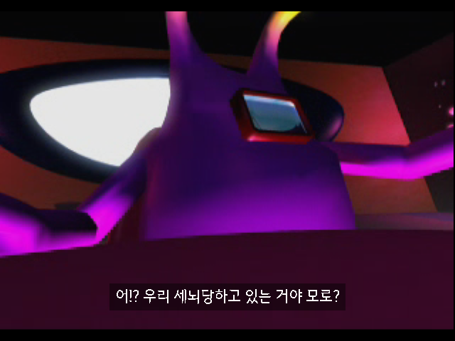
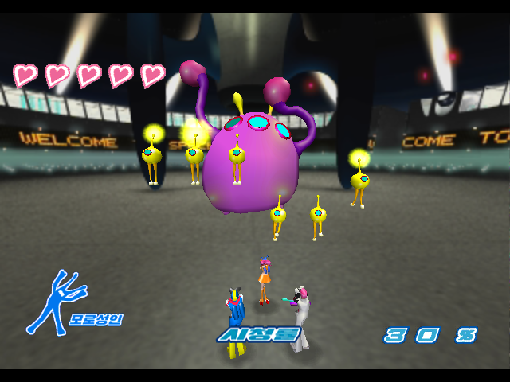
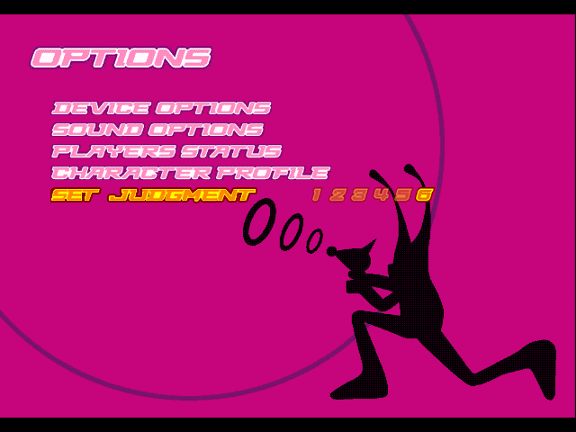

# Space Channel 5 — V1.1 비공식 한글판 정식 버전

**Dreamcast 일본판 한국어 패치 · KOREAN LOCALIZATION BY GIKAKNO**

[V1.1 다운로드](https://github.com/OldManCraveGuitars-bit/DC-Space-Channel-5-Kr/releases/tag/v1.1) · [설치 방법](#설치-방법) · [변경 기록](CHANGELOG.md) · [오류 제보](https://github.com/OldManCraveGuitars-bit/DC-Space-Channel-5-Kr/issues)

일본어 텍스트·이미지 문구를 한국어로 옮기고 음성·영상에 한국어 자막을 추가한 **비공식 한글판 정식 배포 버전**입니다. 원래 영어 표기는 유지합니다.

자막과 판정 옵션은 게임 디스크 내부에 들어 있습니다. 패치한 **CHD 또는 GDI/BIN**으로 실행하며, 별도의 자막 파일이나 개조 에뮬레이터가 필요하지 않습니다. 원본 게임과 BIOS는 배포하지 않습니다.

## 다운로드

일반 플레이에는 **Patch ZIP**을 받으세요. Workbench는 번역·이미지·자막을 직접 편집할 때 사용하는 별도 도구입니다.

| 파일 | 용도 |
| --- | --- |
| [DC-Space-Channel-5-Kr-v1.1-Patch.zip](https://github.com/OldManCraveGuitars-bit/DC-Space-Channel-5-Kr/releases/download/v1.1/DC-Space-Channel-5-Kr-v1.1-Patch.zip) | 차이 패치, Windows 적용기, GDI/CHD 생성 도구 |
| [DC-Space-Channel-5-Kr-v1.1-Workbench.zip](https://github.com/OldManCraveGuitars-bit/DC-Space-Channel-5-Kr/releases/download/v1.1/DC-Space-Channel-5-Kr-v1.1-Workbench.zip) | Workbench v16, 번역·수정 이미지·자막 데이터와 작업 소스 |
| [DC-Space-Channel-5-Kr-v1.1-Text.csv](https://github.com/OldManCraveGuitars-bit/DC-Space-Channel-5-Kr/releases/download/v1.1/DC-Space-Channel-5-Kr-v1.1-Text.csv) | 일본어·한국어·자막 시간·검수 상태를 대조하는 861행 CSV |
| [SHA256SUMS.txt](https://github.com/OldManCraveGuitars-bit/DC-Space-Channel-5-Kr/releases/download/v1.1/SHA256SUMS.txt) | 배포 파일 체크섬 |

## 설치 방법

**대상 원본:** 일본판 Space Channel 5의 5트랙 CUE/BIN 덤프. 다른 지역판, 기존 한글 패치본, 트랙 5의 INDEX 00 데이터가 제거된 덤프에는 적용할 수 없습니다. 적용기가 원본 크기와 SHA-256을 검사합니다. [대상 원본 해시](docs/original-and-output-hashes.json)

1. Patch ZIP을 새 폴더에 모두 압축 해제합니다. 적용기와 `manifest.json`, `bin`, `patches` 폴더를 함께 둡니다.
2. **SC5KoreanPatcher_v1.1.exe**를 실행합니다. Python 설치는 필요하지 않습니다.
3. 일본판 원본 BIN 5개가 있는 폴더를 선택합니다.
4. 아직 존재하지 않는 새 출력 폴더를 지정합니다. 출력 드라이브에 **3GB 이상**의 여유 공간을 확보합니다.
5. **한국어 패치 적용**을 누릅니다. 원본 검사 → 패치 적용 → 결과 검사 → CHD 생성·검증 순서로 진행합니다.
6. 생성된 **Space Channel 5 Korean Native.chd** 또는 **Space Channel 5 Korean Native.gdi**를 실행합니다.

GDI를 사용할 때는 같은 폴더의 `track01.bin`~`track05.bin`을 모두 함께 옮깁니다. `CHD도 생성`을 해제하면 GDI와 BIN만 만듭니다. 원본은 덮어쓰지 않으며 결과 폴더의 `patch-result.json`에 검증 기록을 남깁니다.

**이전 버전에서 업데이트:** 기존 패치본에 덧씌우지 말고, 원본 일본판에서 V1.1을 새로 적용하세요. 기존 VMU는 보존합니다. 에뮬레이터에서 같은 가상 VMU를 지정하면 진행 상황을 이어갈 수 있습니다. 이전 버전의 에뮬레이터 상태 저장 대신 새 디스크로 부팅하고 게임의 LOAD를 사용하세요.

## V1.1 주요 변경 사항

v0.85 이후 수정한 결과 화면·프로필·후반 영상 작업을 통합했습니다. 이전 버전의 저장 안내문, 보스 그래픽, 판정 옵션과 VMU 저장 기능도 포함합니다.

### 결과 화면의 텍스처 겹침 수정

- **목표 시청률 / 최종 시청률 / 최고! 시청률 / 구조 달성률 / 예상 시청률** 주변으로 다른 글자가 늘어나거나 겹치던 문제를 수정했습니다.
- 한글 문구를 그린 뒤 다음 항목에서 사용할 원래 텍스처 상태를 올바르게 복원합니다.
- 사용자가 수정한 글씨 PNG의 디자인과 크기는 유지했습니다.

### 프로필 본문 가독성과 분류 제목 수정

- 흰 획과 도트가 사라지던 문제를 수정했습니다. **‘원활하게’의 ‘활·하’에서 ㅎ 윗획이 빠지던 부분**도 포함합니다.
- 영덕 블루로드체를 유지하고, 본문을 최종 표시 크기로 렌더링해 게임에서 세로 축소 없이 표시합니다.
- CPRO 텍스트 카드 **79장**의 압축 후 픽셀을 대조했습니다. 원래 파일 크기와 텍스처 메모리 사용량을 유지합니다.
- **춤추는 사람**의 마지막 ‘람’, **모로성인**의 하단 잘림을 수정했습니다.
- **악기인·지구인**을 포함한 여섯 분류 제목을 선택 화살표 중앙에 정렬했습니다.

다른 분류 화면: [춤추는 사람](docs/screenshots/22-profile-dancing-v11.png) · [모로성인](docs/screenshots/23-profile-morolians-v11.png) · [지구인](docs/screenshots/25-profile-earth-v11.png)

### 후반 영상의 일본어 대사와 자막 위치 정리

- 시나리오 3 이후 모로성인 회의 영상 **R4_MAKUMA.SFD**에 남아 있던 일본어 원문 대사 **12구간**을 영상에서 제거했습니다.
- 한국어는 기존 **영덕 블루로드체 22px와 약 45% 불투명도의 검은 배경**을 사용합니다. 문장 길이에 맞춰 배경이 표시됩니다.
- 해당 대사의 한국어 자막을 아래쪽의 원래 대사 위치에 맞췄습니다. 번역과 자막 시작·종료 시간은 유지했습니다.
- **네 개의 리포트 제목 영상과 제목 자막은 그대로 유지했습니다.**
- 영상 1,619프레임을 보존했고 ADX 음성은 재압축하지 않았습니다. 전체 디코딩 음성의 바이트가 원본과 일치합니다.

위 결과·프로필 화면은 해당 수정 디스크를 공식 Flycast 코어로 실행한 캡처입니다. 영상 화면은 같은 수정 영상을 테스트용 장면 연결로 재생한 캡처이며, 배포 디스크에는 원래 장면 연결을 복원했습니다. [화면별 기록](docs/verification/screenshots.json)

### 함께 포함되는 기존 수정

- 저장·불러오기 안내문의 흰 글자 번짐과 **SAVE의 E 오른쪽 잘림** 수정.
- 1스테이지 보스 **코코★타피오카**가 등장한 뒤 전투 중 몸 텍스처가 깨지던 문제 수정.
- 한글 HUD의 그래픽 메모리 사용량을 줄이고 사용자 수정 PNG의 ARGB4444 표시 픽셀 보존.
- 튜토리얼 안내 이미지와 중복되던 하단 자막 정리, 누락된 음성 안내 자막 보완.
- 엔딩의 SEGA 위 빈 공간 중앙에 **KOREAN LOCALIZATION BY GIKAKNO** 크레딧 추가.

LOAD 화면의 `SPACEPORT` 끝부분, 숫자와 `%`의 좁은 간격, 숫자 번짐은 같은 세이브·설정에서 일본판과 동일함을 확인해 유지했습니다.

## SET JUDGMENT — 입력 판정 완화

OPTIONS 맨 아래 **SET JUDGMENT 1 2 3 4 5 6**에서 입력 타이밍의 여유를 조절합니다. 기본값 **1**은 원래 판정입니다.

| 선택 | 원래 성공 판정 앞·뒤에 각각 추가되는 시간 |
| --- | --- |
| **1** | 0초 — 기본 판정 |
| **2** | 0.02초 |
| **3** | 0.04초 |
| **4** | 0.06초 |
| **5** | 0.08초 |
| **6** | **0.10초** |

위/아래로 해당 줄을 선택한 뒤 **A / START / 오른쪽**으로 다음 단계, **왼쪽**으로 이전 단계를 선택합니다. 양끝에서 순환하며 선택되지 않은 숫자는 50% 반투명으로 표시됩니다. 방향과 버튼의 일치 여부는 게임의 원래 규칙을 따릅니다.

### 설정 저장과 일본판 세이브 호환

- 선택값을 **VMU에 자동 저장**하고 완전히 종료한 뒤 새로 부팅해도 불러옵니다. 저장값이 없으면 1입니다.
- 마지막 변경 후 약 1.5초(90프레임)에 저장을 시작합니다. **변경 후 약 3초 기다렸다가 종료**하세요. 프레임 속도가 낮으면 더 오래 걸릴 수 있습니다.
- 별도 파일 **SC5KR_JUDGE / 2블록**을 사용합니다. VMU가 없거나 공간이 부족하면 다음 부팅까지 저장되지 않습니다.
- 기존 일본판의 `SPACECH5_001` 등 **진행 세이브 형식은 바꾸지 않습니다.** 일본판과 한글판에서 같은 진행 세이브를 사용할 수 있습니다. 일본판 자체에는 판정 완화가 적용되지 않습니다.

## 한글화 구성

| 항목 | 반영 범위 |
| --- | --- |
| 음성 자막 | 238개 파일, 520구간 |
| 영상 자막 | 6개 파일, 26구간 |
| ROM 내장 자막 합계 | 244개 미디어 연결, 546구간 |
| CPRO 텍스트 카드 | 79장 |
| 이미지 문구 | 아틀라스 30장, 일본어 166개 문구와 추가 크레딧 1개 |
| SAN 배경 이미지 | 4프레임의 일본어 로고 8곳 |
| 대조용 텍스트 목록 | 861행 CSV |

번역은 원문의 의미와 말투를 살리는 것을 기준으로 합니다. 영어는 유지하고 인물 이름은 **푸딩**으로 표기합니다. 위 수치는 등록·반영된 자료의 수이며 모든 분기의 청취 검수 완료를 뜻하지는 않습니다.

## 번역·이미지 편집

Workbench ZIP의 **SC5KoreanWorkbench_v16.exe** 또는 `run_workbench.cmd`를 실행하고 원본 디스크 폴더를 지정합니다. 원문·번역, 이미지, 음성·영상 자막, SAN 프레임을 편집할 수 있습니다. 편집기 실행에는 별도 Python 설치가 필요하지 않습니다.

후반 영상 수정분도 원본을 요구하는 차이 패치로 제공합니다. 편집기가 사용자 디스크에서 수정 영상을 복원해 미리보기와 재빌드에 사용합니다. CSV는 대조용이며 CSV 수정만으로 게임에 반영되지는 않습니다.

ROM을 직접 다시 생성하려면 SH-4 컴파일러와 CHD 도구가 추가로 필요합니다. [개발 및 편집 안내](docs/DEVELOPMENT.md)

## 검증 범위

- 공식 Flycast 코어에서 결과 화면, 프로필 본문·분류 제목, 후반 영상 재생과 게임 전환을 확인했습니다.
- V1.1 배포 적용기로 원본 일본판을 다시 패치해 **트랙 5개와 CHD가 기준 빌드의 SHA-256과 일치**함을 확인했습니다. 배포 확인 기록은 [패치 적용 검증](docs/verification/patch-roundtrip.json)에 있습니다.
- 기존 판정 106개 검사, VMU 저장·새 부팅 복원, 일본판 진행 파일 보존 검증은 v0.8/v0.81 기록을 유지합니다.
- **물리 Dreamcast/ODE는 미검증**입니다. 전체 Normal/Extra 분기와 원음 청취의 추가 검수 범위는 [검수 상태](docs/TRANSLATION_REVIEW.md)에 정리했습니다.

정식 버전 표기는 이 비공식 패치의 배포 구분입니다. SEGA의 공식 제품 또는 실기 인증을 의미하지 않습니다.

## 오류 제보와 크레딧

[Issues](https://github.com/OldManCraveGuitars-bit/DC-Space-Channel-5-Kr/issues)에 **버전, 리포트 번호, Normal/Extra 여부, 에뮬레이터·ODE 이름, 화면이나 짧은 영상**을 남겨 주세요. 자막 문제는 들리는 대사와 발생 시점도 함께 적어 주세요.

한국어화: **GIKAKNO**. 원작 게임·캐릭터의 권리는 **SEGA 및 해당 권리자**에게 있습니다. 사용 글꼴은 영덕군 **영덕 블루로드체**입니다. 패치·편집 도구의 구성요소와 라이선스는 [THIRD_PARTY_NOTICES.md](THIRD_PARTY_NOTICES.md)에 있습니다.
