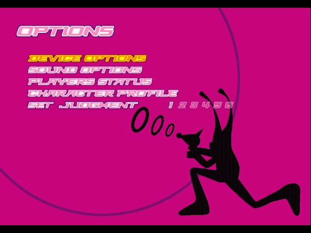
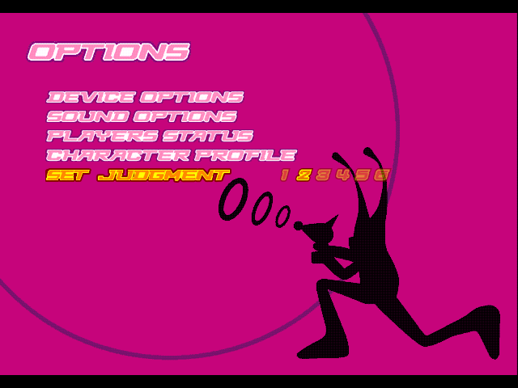
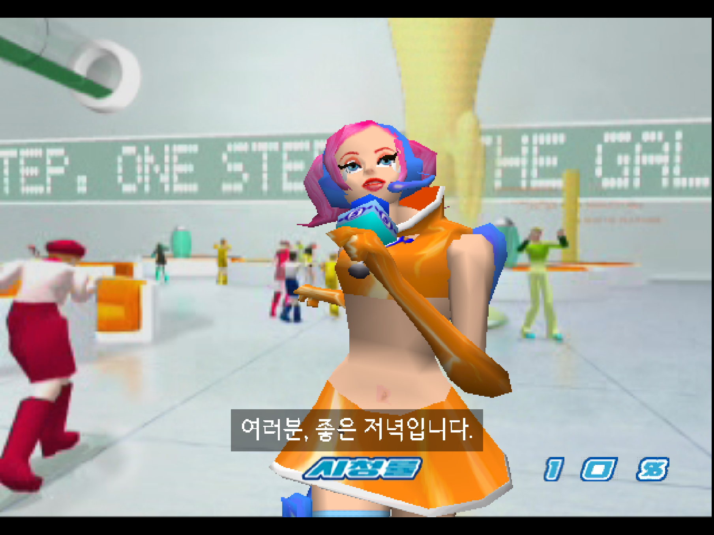
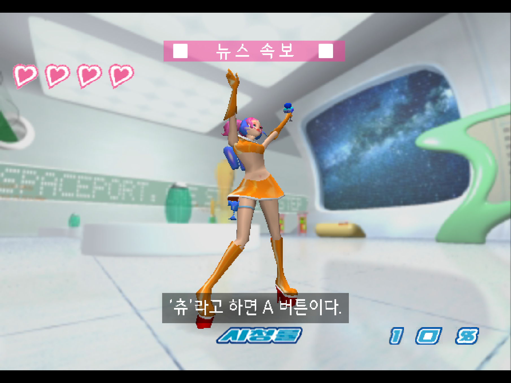
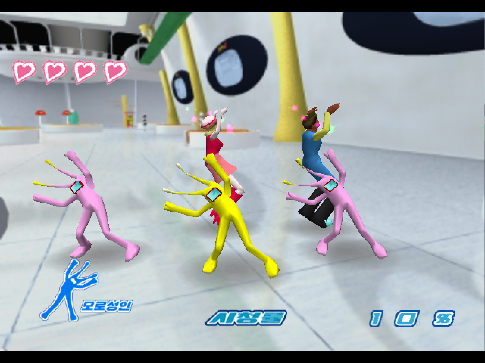
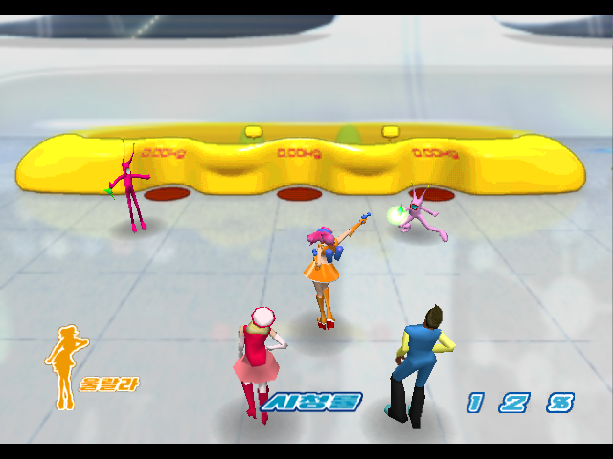
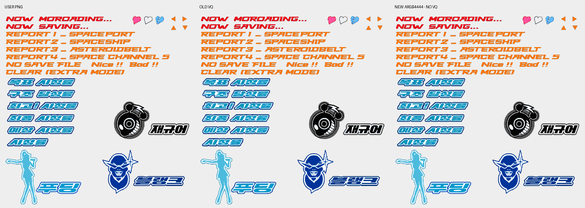
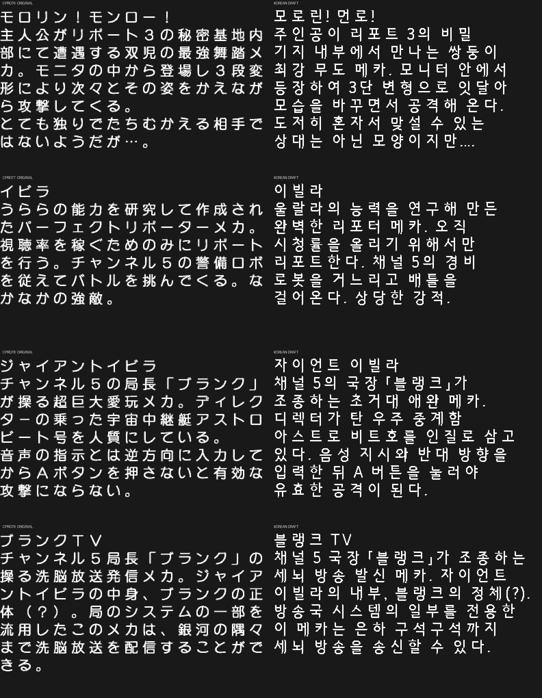
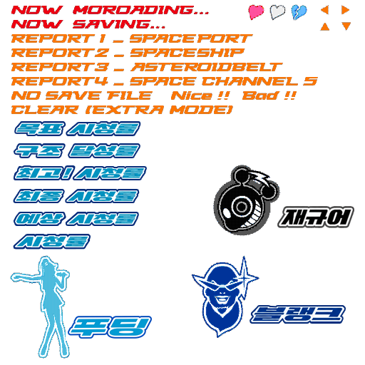
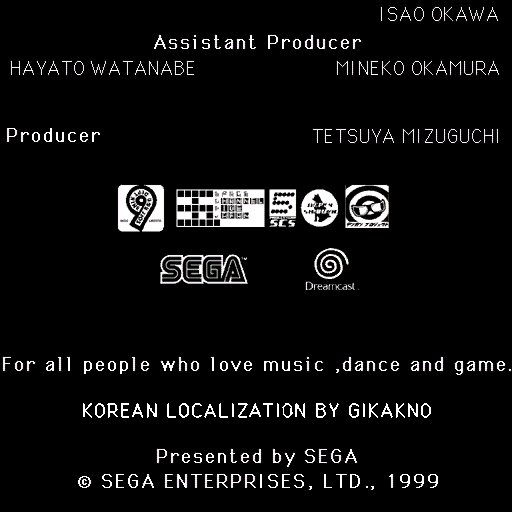

# DC Space Channel 5 한국어 패치 v0.8

**Dreamcast 일본판 Space Channel 5의 비공식 한국어 패치 — 공개 테스트 버전**

**KOREAN LOCALIZATION BY GIKAKNO**

[v0.8 다운로드](https://github.com/OldManCraveGuitars-bit/DC-Space-Channel-5-Kr/releases/tag/v0.8) · [오류 제보](https://github.com/OldManCraveGuitars-bit/DC-Space-Channel-5-Kr/issues) · [상세 변경 기록](CHANGELOG.md)

일본어 텍스트와 이미지 문구를 한국어로 옮기고, 원래 자막이 없는 음성 및 영상에 한국어 자막을 추가했습니다. **자막 코드·글리프·문장·시간 정보가 게임 디스크 내부에 들어 있습니다.** 패치한 디스크를 실행하면 자막이 표시되며, 개조 에뮬레이터나 외부 자막 파일이 필요하지 않습니다.

v0.8은 현재까지 작업한 내용을 공개하는 시험판입니다. 일본어 전체를 번역하는 것을 목표로 작업 중이며, 원음 청취·모든 분기·물리 Dreamcast 검증은 아직 남아 있습니다. 현재 확인한 범위는 아래에 따로 정리했습니다.

## v0.8 업데이트 — SET JUDGMENT

입력 타이밍에 여유를 주는 **판정 완화 옵션**을 게임 내부에 추가했습니다. OPTIONS의 기존 네 항목 아래에서 `SET JUDGMENT 1 2 3 4 5 6`을 선택할 수 있습니다. 패치한 디스크 하나에 메뉴·그림·판정 코드가 들어 있습니다.

### 판정 단계

| 선택 | 원래 성공 판정의 앞쪽에 추가 | 원래 성공 판정의 뒤쪽에 추가 |
| --- | --- | --- |
| **1** | 0초 — 원래 판정 | 0초 — 원래 판정 |
| **2** | 0.02초 / 20ms | 0.02초 / 20ms |
| **3** | 0.04초 / 40ms | 0.04초 / 40ms |
| **4** | 0.06초 / 60ms | 0.06초 / 60ms |
| **5** | 0.08초 / 80ms | 0.08초 / 80ms |
| **6** | **0.10초 / 100ms** | **0.10초 / 100ms** |

표의 값은 원래 판정에 더하는 시간입니다. 원래 판정 폭 자체는 곡의 템포와 노트 배치에 따라 달라집니다. 현재 템포를 읽어 초 단위의 추가 시간을 게임의 박자 단위로 환산합니다. 방향·A/B의 일치 여부는 게임의 원래 판정 루틴을 사용합니다.

### 조작과 저장

1. 메인 메뉴에서 **OPTIONS**로 들어갑니다.
2. 위/아래로 맨 아래 **SET JUDGMENT** 줄을 선택합니다. 맨 위에서 위를 눌러도 이 줄로 이동합니다.
3. **A / START / 오른쪽**: 다음 단계. **6 → 1**로 순환합니다.
4. **왼쪽**: 이전 단계. **1 → 6**으로 순환합니다.
5. 선택한 숫자는 선명하게, 나머지는 **50% 반투명**으로 표시됩니다. 선택 중인 줄은 기존 OPTIONS처럼 노란색으로 강조됩니다.

기본값은 **1**입니다. 같은 게임 실행 중에는 옵션을 나갔다 들어오거나 새 게임을 시작해도 선택값을 유지합니다. **게임을 완전히 종료하고 새로 부팅하면 1로 돌아갑니다.** 이 설정을 VMU에 저장하는 기능은 없습니다.

### 실제 게임 화면

아래 옵션 화면은 **최종 v0.8 디스크를 개조하지 않은 Flycast libretro 코어로 실행한 캡처**입니다. 외부 자막이나 코어 메모리 쓰기를 사용하지 않았습니다.

**기본 1단계 — 기존 항목 아래에 새 옵션 추가**

**2단계 선택 — 선택 숫자와 반투명 숫자 구분**

**6단계 선택 — 앞뒤 최대 0.10초 추가**

### 글씨·숫자 디자인 수정

- 기존 옵션의 기울기·테두리·분홍/흰색 계열에 맞춰 새 줄을 제작했습니다.
- 숫자 모양, 문구의 위아래 가장자리, JUDGMENT 글자 겹침과 마지막 T 끝부분을 정리한 뒤 사용자가 직접 수정한 최종 PNG를 적용했습니다.
- **SET_JUDGMENT_2.png, 429×24**의 크기·위치·투명 영역을 보존합니다. 다시 그리거나 크기를 바꾸지 않습니다.
- 새 줄은 VQ 압축 없이 ARGB4444 색상 도형으로 표시합니다. 게임의 채널당 4비트 색상·알파 정밀도에 맞춘 양자화만 적용합니다.
- 레이블과 여섯 숫자를 별도로 표시해 선택 숫자의 반투명 효과를 유지합니다.
- Workbench v8과 소스 빌더도 `data/judgment_artwork.json`에 지정한 PNG를 사용합니다. 다음 ROM 생성 때 자동 생성 글씨로 되돌아가지 않습니다.

사용자가 제공한 제작 PNG입니다. 위 세 장은 실제 게임 화면이며, 아래는 편집 자료입니다.

### v0.8 검증 범위

- 두 플레이어 판정 루틴, 두 템포, 1~6단계의 앞/뒤 경계와 잘못된 버튼 입력을 포함한 **100개 검사**를 원래 SH-4 판정 루틴으로 확인했습니다.
- 판정 범위가 겹칠 때 이미 처리한 노트에서 다음 노트로 넘어가는 **6개 연속 노트 검사**를 확인했습니다. 이 106개 검사는 최종 PNG 수정 전 빌드에서 수행했고, 이후 변경은 그림 표시와 PNG 가져오기입니다.
- 최종 v0.8 디스크의 기본값 1, 선택 2/6, 반투명 표시와 메뉴 진입을 공식 코어에서 확인했습니다.
- 사용자 PNG의 모든 표시 픽셀이 ARGB4444 양자화 결과와 일치하는지 검사했습니다.
- 최종 GDI의 실행 파일·COMMON 이미지·사운드 드라이버·음원 파일 읽기 결과와 섹터 EDC/ECC, CHD 무결성을 확인했습니다.
- 배포 `.exe`로 원본 일본판을 실제 패치해 결과 트랙 5개와 CHD가 기준 빌드와 일치하는지 확인했습니다. 근거는 [배포 패치 검증](docs/verification/patch-roundtrip.json)에 보존합니다.

물리 Dreamcast/ODE, 모든 빠른 연타·홀드 조합 및 Normal/Extra 전체 플레이 분기는 추가 검증 대상입니다. 기존 음성 청취·번역 검수의 남은 항목도 아래에 유지합니다.

### v0.7 사용자가 업데이트할 때

v0.8 Patch ZIP을 새 폴더에 풀고 **원본 일본판 5개 BIN에서 다시 적용**합니다. v0.7으로 패치한 CHD/BIN은 원본 선택 대상으로 사용할 수 없습니다. 새 결과 폴더에 생성한 CHD 또는 GDI/BIN으로 게임을 실행합니다.

## 다운로드와 패치 적용

### 필요한 파일

| 다운로드 | 용도 |
| --- | --- |
| `DC-Space-Channel-5-Kr-v0.8-Patch.zip` | 일본판 원본에 적용하는 패치, Windows용 `.exe` 패치 도구, GDI/CHD 생성 도구 |
| `DC-Space-Channel-5-Kr-v0.8-Workbench.zip` | 독립 실행형 번역·이미지·음성 편집기 v8와 현재 프로젝트 데이터 |
| `DC-Space-Channel-5-Kr-v0.8-Text.csv` | 일본어·한국어·자막 시간·검수 상태를 대조하는 861행 CSV |
| `SHA256SUMS.txt` | 배포 파일 SHA-256 체크섬 |

패치 ZIP에는 원본 게임 디스크와 Dreamcast BIOS가 들어 있지 않습니다. 대상은 **일본판 5트랙 CUE/BIN 덤프**입니다. 이미 한글화한 트랙·다른 지역판·트랙 5의 INDEX 00이 제거된 덤프에는 적용하지 않습니다. 트랙별 크기와 SHA-256은 [대상 원본 및 결과 해시](docs/original-and-output-hashes.json)에 있습니다.

### Windows에서 적용

1. 패치 ZIP을 한 폴더에 모두 압축 해제합니다. `.exe`, `manifest.json`, `bin`, `patches`를 함께 둡니다.
2. `SC5KoreanPatcher_v0.8.exe`를 실행합니다. 별도 Python 설치는 필요하지 않습니다.
3. 일본판 원본 BIN 5개가 있는 폴더를 선택합니다.
4. **아직 존재하지 않는 새 출력 폴더**를 지정합니다. 출력 드라이브에 3GB 이상 여유 공간을 확보합니다.
5. **한국어 패치 적용**을 누릅니다. 원본 5개 트랙 확인 → 패치 적용 → 결과 트랙 확인 → CHD 생성 → CHD 무결성 및 SHA-256 확인 순서로 진행합니다.
6. 생성된 `Space Channel 5 Korean Native.chd` 또는 `Space Channel 5 Korean Native.gdi`를 실행합니다. GDI를 사용할 때는 같은 폴더의 `track01.bin`~`track05.bin` 5개가 모두 필요합니다.

`CHD도 생성`을 해제하면 GDI와 BIN만 만듭니다. 원본은 덮어쓰지 않으며, 결과 폴더의 `patch-result.json`에 검증 결과를 남깁니다. 오류로 중단된 출력 폴더는 진단을 위해 보존하므로, 다시 적용할 때 다른 새 출력 폴더를 지정합니다.

CHD는 해당 형식을 지원하는 에뮬레이터에서 사용합니다. 실기에서는 GDI를 지원하는 ODE의 사용법에 따라 GDI와 5개 BIN을 함께 옮깁니다. **물리 Dreamcast/ODE에서의 동작은 아직 시험하지 않았습니다.**

## v0.7에서 이어받은 한글화 작업

| 항목 | 현재 반영 범위 |
| --- | --- |
| 음성 자막 | 음성 파일 238개, 한국어 자막 520구간 |
| 영상 자막 | 영상 파일 6개, 한국어 자막 26구간 |
| ROM 내장 자막 합계 | 미디어 연결 244개, 자막 546구간, 글리프 506개 |
| CPRO 텍스트 카드 | 79장에 일본어 대조 번역 초안 반영 |
| 이미지 한글화 | 아틀라스 30장, 등록 문구 167개 — 일본어 166개와 추가 크레딧 1개 |
| 고정 안내 이미지 | 위 이미지 범위에 포함: `jimaku` 아틀라스 18장, 뉴스·경고·조작 안내 등 96개 문구 |
| SAN 배경 이미지 | 4프레임의 일본어 로고 8곳 수정 |
| 별도 텍스트 목록 | 일본어·한국어·시간·검수 상태를 담은 861행 CSV |

집계는 서로 겹치는 항목이 있습니다. 고정 안내 18장은 이미지 30장에 포함됩니다. 546구간은 현재 ROM에 넣은 자막 수이며, 모든 일본어 대사와 분기의 번역 완료를 뜻하지 않습니다.

### 1. 게임 내부 음성·영상 자막

- `1ST_READ.BIN`에 SH-4 자막 표시 코드를 넣었습니다. 게임의 음성·영상 시작/종료와 화면 제출 시점에 연결합니다.
- 원래 자막이 없는 인사, 설명, 반응, 조작 안내 등에 음성 재생 시간에 맞춰 한국어를 표시합니다. 미디어 번호를 기준으로 연결하므로 등록한 성공·실패·다른 진행 음성도 해당 음성이 재생될 때 자막을 찾습니다. 전체 분기의 실제 재생 검증은 계속 필요합니다.
- 파일 읽기 시작 시간이 아닌 **유효한 음성 샘플 시계**를 사용합니다. 재생 준비 상태를 대사 재생으로 판단하지 않도록 처리했습니다.
- 글꼴은 **영덕 블루로드체**, 기본 자막 크기는 22px, 줄 간격은 28px입니다. 글꼴의 실제 문자 폭을 사용해 띄어쓰기와 점·쉼표·따옴표를 배치합니다.
- 검은 자막 상자의 불투명도는 **115/255, 약 45%**입니다. 기본 위치는 하단 시청률 HUD 위이며, 일부 문장은 개별 위치를 사용합니다.
- 영상 자체에 인코딩된 일본어는 한국어 자막으로 보완하고, 별도 글씨 이미지가 존재하는 경우에는 그 이미지를 수정합니다.

### 2. 첫 A 버튼 음성 안내 누락 복구

`VOICEDATA.AFS:118`의 첫 대사를 복구했습니다.

| 원문 | 한국어 | 해당 음원 내 시간 |
| --- | --- | --- |
| チューと言ったらAボタンだ。 | ‘츄’라고 하면 A 버튼이다. | 0.00~1.54초 |
| 了解。 | 알겠습니다. | 1.76~2.10초 |

첫 문장은 상단 고정 조작 안내가 등장하기 전에 음성 자막으로 표시됩니다. 상단 안내와 하단에 같은 문장을 계속 중복 표시하던 처리에서, 실제 음성 구간을 기준으로 표시하는 방식으로 정리했습니다.

최종 v0.7 ROM에서 첫 문장의 출력을 다시 캡처했습니다. 짧은 `알겠습니다.`는 이전 546구간 빌드에서 화면으로 확인했고, 현재 빌드에도 같은 자막과 시간이 유지됩니다. 이번 최종 빌드 캡처에서는 짧은 응답 구간을 따로 확보하지 못했습니다.

### 3. 메인 로고·HUD·인물 이름·일본어 이미지

- 메인 타이틀의 일본어 로고를 **스페이스 채널 5**로 교체했습니다. 원본의 파란색·흰색 테두리·기울기·발광 효과와 큰 숫자 5를 살리는 방향으로 작업했습니다.
- 목표/구조 달성/최고/최종/예상 시청률, 뉴스 속보, 조작 안내, 도감 분류, 경고 문구와 인물 이름 등을 한글화했습니다.
- 캐릭터 이름 **푸딩**을 적용했습니다. 재규어와 모로성인 표기의 잘림을 수정하는 작업도 반영했습니다.
- 원래 영어 문구는 유지합니다. `PRESS START BUTTON`, 리포트 영문 제목, 영어 옵션 등은 번역 대상에서 제외했습니다.
- 마지막 크레딧에 **KOREAN LOCALIZATION BY GIKAKNO**를 추가했습니다. `Presented by SEGA` 위의 빈 공간 가운데에 배치했습니다. 해당 배치의 이전 실제 엔딩 화면 검수는 진행했으며, 최종 v0.7 내장 자막 ROM의 엔딩 재검증은 남아 있습니다.

### 4. 사용자 제공 이미지의 VQ 압축 뭉개짐 개선

시청률과 재규어·푸딩·블랭크 문구가 있는 `COMMON_DATA.PVM:114`를 전체 VQ로 다시 압축했을 때, 작은 글자와 테두리가 뭉개지는 문제를 확인했습니다.

- 최종 빌드에서는 해당 텍스처를 **VQ를 사용하지 않는 일반 ARGB4444 텍스처**로 저장했습니다.
- 사용자 제공 PNG를 다시 그리거나 테두리를 재정리하지 않았습니다. 원본 PNG는 그대로 보존하고, 게임 저장 형식에 따른 채널당 4비트 양자화만 적용했습니다.
- 등록한 일본어 수정 영역 바깥은 원본 디코딩 픽셀과 동일하게 보존했습니다. 같은 PVM의 나머지 291개 텍스처 멤버도 바이트 단위로 유지했습니다.
- 해당 PVR은 67,616바이트에서 524,304바이트로, COMMON PVM은 784,544바이트에서 1,241,232바이트로 늘었습니다.
- 늘어난 공간을 확보하기 위해 내용이 같은 `R21.MPB`와 `R22.MPB`가 동일 데이터 영역을 참조하도록 정리하고 95개 파일을 재배치했습니다. 재배치한 파일은 읽기 결과·내용 해시·섹터 EDC/ECC를 검증했습니다.
- 디스크의 트랙 길이와 구조는 유지했습니다. 트랙 5의 INDEX 00에는 실제 사운드 데이터가 있어 해당 450섹터를 보존했습니다.
- 파일 위치 변경 후에는 생성된 ISO 디렉터리의 AFS 위치를 다시 읽어 자막 음원 연결에 반영했습니다.

양자화가 있으므로 PNG와 저장된 텍스처가 모든 픽셀에서 완전히 같다는 뜻은 아닙니다. VQ 패턴 선택으로 생기던 글자 모양의 손실을 제거한 수정입니다.

## 작업 화면

아래 기존 게임 플레이 화면은 **최종 v0.7 CHD를 개조하지 않은 공식 Flycast libretro 코어로 실행한 화면**입니다. 외부 자막 표시와 코어 메모리 변경을 사용하지 않았습니다. 캡처 파일은 별도 그림 보정을 하지 않았습니다.

### 첫 인사 — 음성에 맞춘 내장 자막

### 복구한 ‘츄’ A 버튼 안내와 뉴스 속보

### 시청률 HUD와 모로성인 표기

### CPU 자동 플레이 확인

### 텍스처 화질 비교 — 이미지 미리보기

왼쪽: 제공 PNG / 가운데: 이전 VQ 압축 / 오른쪽: 최종 ARGB4444 비압축 저장. 아래 비교는 텍스처 미리보기이며 게임 캡처와 구분됩니다.

### CPRO 텍스트 카드 원문·번역 비교 — 제작 미리보기

### 사용자 제공 시청률·인물 이름 아틀라스 — 제작 원본

### 도감 분류 이미지 — 제작 미리보기

### 엔딩 크레딧 추가 — 제작 텍스처

아래는 크레딧을 추가한 텍스처 자료입니다. 최종 v0.7 ROM의 엔딩 재생 캡처는 아직 확보하지 않았습니다.

## 번역 및 편집 도구

Workbench ZIP에는 **`SC5KoreanWorkbench_v8.exe`**와 현재 `data`, 수정 이미지, 글꼴 자료가 들어 있습니다. 브라우저에서 여는 도구가 아닌 Windows 독립 실행형 편집기입니다. `.exe`로 편집·미리보기를 사용할 때 별도 Python 설치는 필요하지 않습니다.

압축을 풀고 편집기를 실행한 뒤 **원본 디스크 선택**으로 대상 일본판 폴더를 지정합니다. 실행 파일을 따로 이동한 경우 **프로젝트 선택**에서 `data/edits.json`이 있는 폴더를 선택합니다.

| 편집 화면 | 기능 |
| --- | --- |
| 원문·번역 | CPRO 카드 원문/한국어 비교, 문장·글자 간격·줄바꿈 편집 |
| 이미지 비교 | PVR/PVM 목록 검색, 원본/수정본 비교, 확대, PNG 내보내기·가져오기 |
| 음성·자막 | 원본 음성 재생, 파형, 일본어/한국어와 시작·끝 시간 편집 |
| 영상·자막 | 영상 재생과 한국어 자막 미리보기, 문장·시간 편집 |
| SAN 프레임 | 프레임별 원본/수정 이미지 비교와 문구·메모 관리 |

`Ctrl+S` 저장, `Ctrl+F` 검색, `Ctrl+Space` 재생/정지. 저장 전 잘못된 자막 시간을 검사하고, 변경 전 자료는 프로젝트의 `work/editor-backups/`에 보관합니다.

861행 CSV는 대조·검토용으로 따로 제공합니다. **CSV를 수정한 것만으로 ROM에 반영되지는 않습니다.** 현재 수정은 Workbench에서 저장해야 하며, 이미지의 문구를 바꿀 때에는 해당 문구가 그려진 PNG도 함께 준비해야 합니다.

편집기에서 변경을 저장한 뒤 기존 ROM이 자동으로 바뀌지는 않습니다. **자막 내장 ROM 생성에는 별도의 SH-4 빌드 도구와 CHD 생성 도구 준비가 필요합니다.** Workbench ZIP에는 SH-4 컴파일러와 플레이어가 포함되지 않습니다. 개발 환경 및 재빌드 방법은 [개발 안내](docs/DEVELOPMENT.md)를 참고하세요. 공개 ZIP의 편집기 v8는 현재 모듈 포함을 확인했으며, 최종 디스크 전체 생성은 소스 실행으로 검증했습니다. ZIP을 새 환경에서 열어 v8의 전체 ROM 생성까지 실행하는 시험은 남아 있습니다.

## 번역 원칙

- **일본어와 한자 표기를 한국어로 옮기고 영어는 유지합니다.**
- 의역과 내용 추가를 줄이고 원문의 의미·말투·인용 관계를 살립니다. 화면 너비에 맞춘 줄바꿈을 사용합니다.
- 원문, 번역, 시간, 검수 상태와 메모를 함께 남깁니다.
- 자동 음성 인식은 초안입니다. 원문 청취와 게임 문맥 검수를 마치지 않은 구간을 최종 검수 완료로 표시하지 않습니다.
- 이름은 사용자가 지정한 **푸딩**을 적용합니다.

## 검증한 범위와 남은 작업

### 확인한 것

- 최종 CHD에서 메인 화면 새 부팅 및 한글 로고 확인.
- 일반 공식 코어에서 첫 리포트의 인사, 뉴스 속보, 복구한 음성 조작 안내 및 HUD 확인.
- 원래 CPU 비기를 입력해 첫 리포트 구출 진행과 **시청률 12%** 화면 확인.
- 현재 패키지의 실행 파일, COMMON PVM, 사운드 드라이버와 사운드 데이터 읽기 결과 및 해당 섹터 EDC/ECC 확인.
- COMMON 비압축 저장, 수정 영역 밖 원본 픽셀 보존, 다른 291개 텍스처 멤버 보존 및 재배치 95개 파일 읽기 검증.
- CHD의 Raw SHA1/Overall SHA1 무결성 확인. 배포용 패치가 만들어 낸 GDI/CHD는 별도 결과 해시 검증 기록으로 제공합니다. v0.8 배포 실행 파일을 사용한 실제 적용 결과는 원본 5개 트랙과 최종 CHD 해시 검사를 통과했습니다.

검증 자료는 [docs/verification](docs/verification)에 있습니다. 화면 캡처는 일정 간격으로 요청했으며, 실제 PNG 완료 간격이 더 길어 짧은 대사와 모든 프레임을 포착하지는 못했습니다.

### 계속 필요한 것

- **물리 Dreamcast 및 ODE 시험.** 실기용 구조로 구현했지만 실기 동작 확인을 완료한 버전은 아닙니다.
- Normal/Extra Mode 전체 진행, 성공/실패와 다른 방·경로에서 나오는 모든 음성·영상 자막 검증.
- 전체 원음 청취 및 원문 느낌을 살린 번역 검수. 현재 인식 결과 중 31구간이 추가 검수 대상이며 20구간은 한국어 문장이 비어 있습니다.
- `VOICEDATA.AFS:225` 첫 문장 재청취. 사용자가 제시한 “위험하잖아~”와 인식 초안이 달라 **미확정** 상태로 남겼습니다.
- 추가 스테이지 음원 71개는 인식 문장이 비어 있어 확인이 필요합니다. 이 숫자를 일본어 대사 71개가 빠졌다는 의미로 집계하지 않습니다.
- 작은 배경 표지, 일부 이미지 UV/잘림, SAN 나머지 수정 프레임의 개별 표시 문맥 확인.
- 튜토리얼, 후반부, 엔딩 크레딧을 최종 내장 자막 ROM으로 다시 검증. 이전 전용 에뮬레이터에서의 진행 기록은 최종 ROM 전체 검증으로 간주하지 않습니다.

## CPU 자동 플레이와 Extra Mode

게임 중 **L + R을 누른 채** 아래를 순서대로 입력합니다.

`↑, ←, A, ←, A, ↓, →, B, →, B`

성공하면 효과음이 나오며 CPU가 플레이합니다. 현재 검수에도 이 비기를 사용했습니다. Extra Mode는 엔딩 후 저장 데이터를 불러오는 방식으로 진행합니다. 자동 플레이로 도달하지 못하는 실패와 다른 음성 분기는 별도로 검수해야 합니다.

## 기준 결과 해시

| 파일 | SHA-256 |
| --- | --- |
| 최종 CHD | `83f00cd80182726b05ad0ac176d2cc6f41e55db207c89b9ba39bcb2f78b8ee34` |
| `track05.bin` | `4f0500c2a2c6e7d9dfb8a61b56b58d2a888ee935907deab0fb9c43957e706177` |
| Workbench v8 `.exe` | `bfac6a635230ed2ee6619bc13bca21b5a7561e3b95ae7e41ab398f099d4eefa3` |

## 오류 제보

[Issues](https://github.com/OldManCraveGuitars-bit/DC-Space-Channel-5-Kr/issues)에 리포트 번호, Normal/Extra 여부, 성공/실패 상황, 화면 또는 짧은 영상, 에뮬레이터/ODE 이름을 적어 주세요. 음성 누락은 들리는 일본어와 나타나야 할 시점을 함께 알려 주면 대조하기 쉽습니다.

## 크레딧 및 사용 자료

한국어화: **GIKAKNO**. 원작 게임과 캐릭터의 권리는 SEGA 및 해당 권리자에게 있습니다. 이 프로젝트는 비공식 번역 작업입니다.

사용 글꼴은 [영덕군 공식 전용서체 안내의 영덕 블루로드체](https://www.yd.go.kr/?page_id=120264)입니다. 글꼴 파일 자체를 수정하지 않았습니다. 패치 생성/적용에는 xdelta3, CHD 생성에는 MAME chdman을 사용합니다. 배포 도구와 편집기에 포함된 구성요소의 안내는 [THIRD_PARTY_NOTICES.md](THIRD_PARTY_NOTICES.md)에 있습니다.
